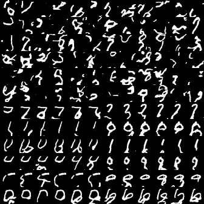
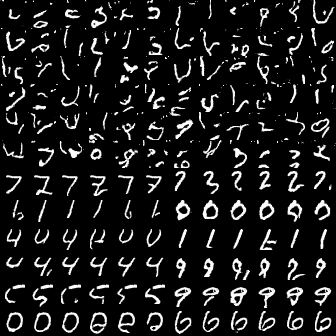
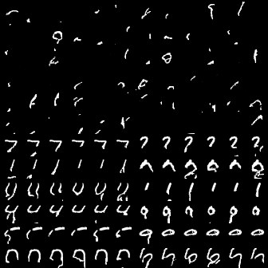
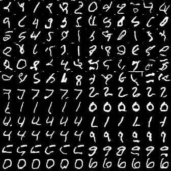
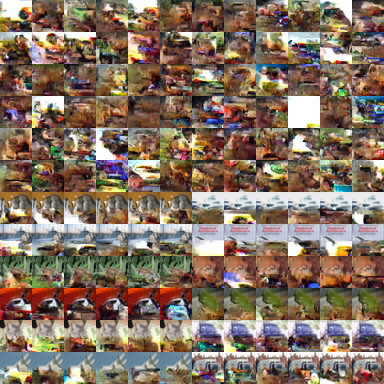
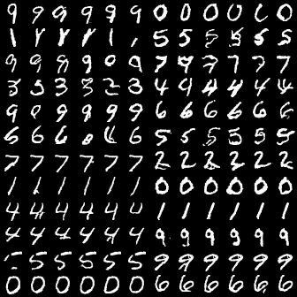
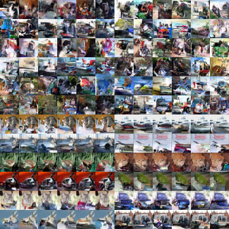

# pixel-models
Pytorch implementations of the PixelCNN (va Oord et al. 2016) and PixelVAE (Gulrajani et al. 2016) models.

## Status

**This project is not finished.** Most models are implemented, but they have not been fully tested, 
to show that they reproduce the performance of the published versions. If you are doing something important,
please don't use this code as is.

Specifically:
* The simple, gated and conditional models seem to work. I'm still checking how close I can get the evaluation to the published numbers.
* CIFAR evaluation is difficult. It took the original authors 60 hours training on 32 GPUs to train a 20-layer model with about 380 channels per layer. That's more than I have available, but I'll see how far I can get with more modest hardware.
* The VAE is a work in progress. It deviates slightly from the published version (for instance by not concatenating the 
VAE output, but using the location-dependent conditional from the original pixelCNN).Most likely, these details are not 
that important.
 
## Tasks (i.e. datasets)

```MNIST``` and ```CIFAR``` datasets are downloaded automatically. The ```imagenet64``` dataset can be 
[downloaded here](http://image-net.org/small/download.php). Place the train and test data in some 
directory (say ```~/data/imagenet/```), containing subdirectories ```train``` and ```valid```. These should each 
contain **an additional subdirectory** (with any name), which contains the images.
 
Then call one of the training scripts as follows:
```python train-cnn.py -t imagenet64 -D ~/data/imagenet/```

## Results

All results show a grid of 12x12 generated images. In the top half, the images are generated from scratch. In the bottom
half, they are are provided with half an image from the dataset to complete.

### Simple pixel CNN (no gates or residual connections)

A very simple network (5 layers, 5 by 5 kernel, 30 channels):
```
python -u /home/pbloem/git/pixel-models/train-cnn.py -e 15 -b 64 -x 5 -k 5 -c 30 -l 0.001 -m simple -t mnist

```
After 15 epochs:



With 9 layers and 63 channels:
```
python -u /home/pbloem/git/pixel-models/train-cnn.py -e 15 -b 64 -x 9 -k 5 -c 63 -l 0.001 -m simple -t mnist

```
After 15 epochs:



### Gated pixelCNN (Oord et al, gates and residuals)

```
python -u /home/pbloem/git/pixel-models/train-cnn.py -e 15 -b 64 -x 5 -k 5 -c 30 -l 0.001 -m gated -t mnist

```
After 15 epochs:



```
python -u /home/pbloem/git/pixel-models/train-cnn.py -e 50 -b 64 -x 9 -k 5 -c 63 -l 0.0001 -m gated -t mnist

```
After _50_ epochs:




#### On CIFAR10 

Note that state-of-the art performance on CIFAR requires training on many GPUs. These are 
basic approximations.

```
python -u /home/pbloem/git/pixel-models/train-cnn.py -e 15 -b 64 -x 12 -k 5 -c 30 -l 0.001 -m gated -t cifar10

```
After 15 epochs:



### Conditional gated pixelCNN

In the conditional variant, we provide the model the with image class as a conditional input.

#### MNIST

```
python -u /home/pbloem/git/pixel-models/train-cond.py -e 15 -b 64 -x 5 -k 5 -c 30 -l 0.001 -m gated -t mnist
```




#### CIFAR10

12 layer, 5x5 kernel after 50 epochs (trained with mixed precision):




### PixelVAE

#### CIFAR10

#### Imagenet 64

## Usage notes

Make sure that the value of the "current pixel" (at the center of the convolution), is not transmitted up the network:
 * Disable self-connections in the first layer
 * For the gated layer, disable the residual connection in the first layer.

## Sources

Some of the code in this repository was adapted from:    
  
* https://github.com/j-min/PixelCNN

## Implementation notes

I noted the following things during implementation. These may be useful if you're trying to port or adapt this code.

* If the model has access to pixel x in its input, for its prediction of pixel x, validation loss will be very low, 
but the samples will converge to black images. This happened, for instance, when I accidentally had a skip connection
in the first layer. If your samples go black, check that the model can't accidentally see the pixel it's predicting.

* The model allows colors to be conditioned sequentially. For instance, when sampling the green value for a pixel, 
we are allowed to see the red value. This seems like a minor improvement, but it's crucial for good performance. Without
it, there is little to no coordination between the colors and the picture looks like random noise.

* The output of a standard log-softmax layer is the natural logarithm of the probability. This gives you the (negative) 
codelength in _nats_. For _bits_ (the standard evaluation metric in these papers) you need to mulitply by log_2(e).  

# Acknowledgements

Development of this library was funded through NWO KIEM project [Score!](https://pbloem.github.io/score) (grant number
 314-98-121). Experiments were run on the [DAS5 cluster](https://www.cs.vu.nl/das5/gpu.shtml).
